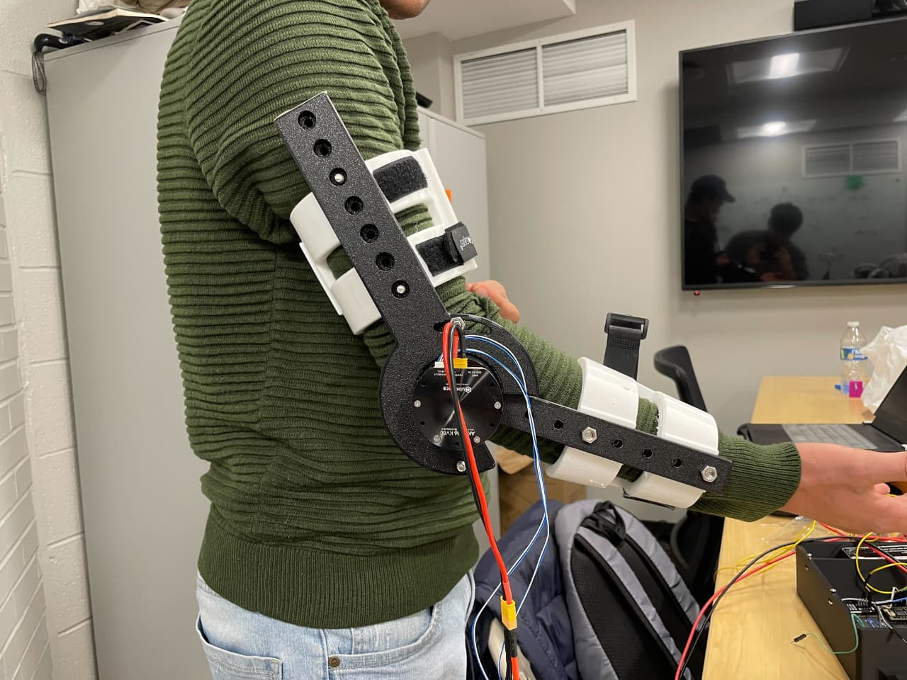
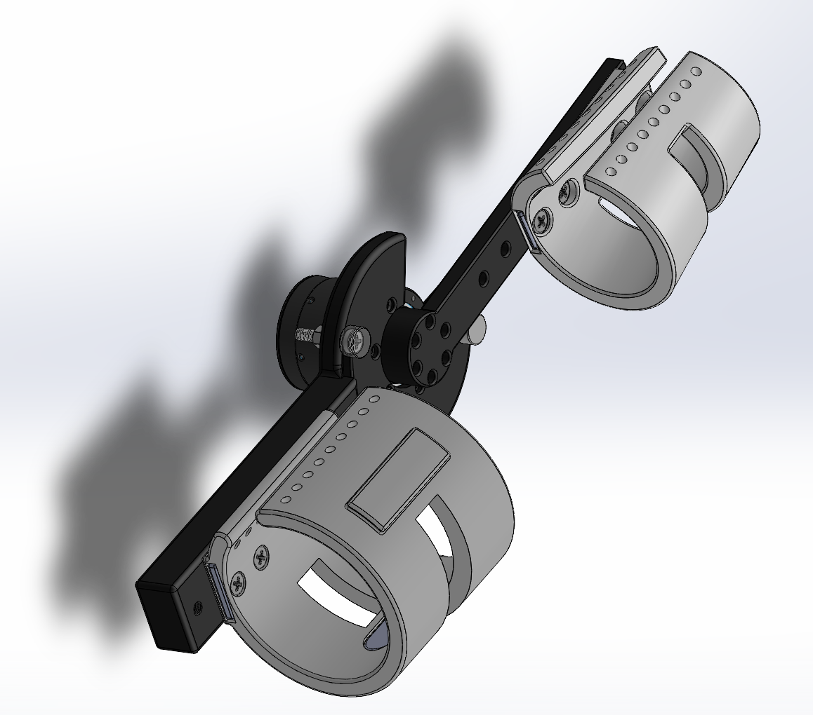
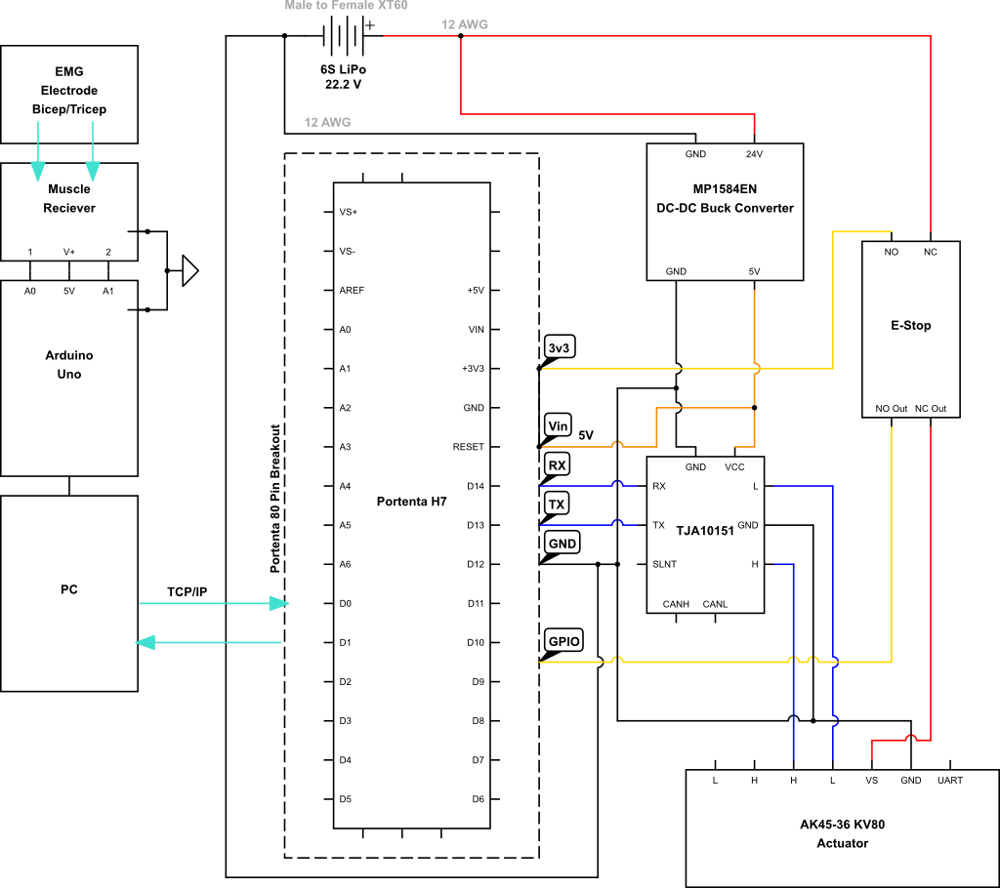
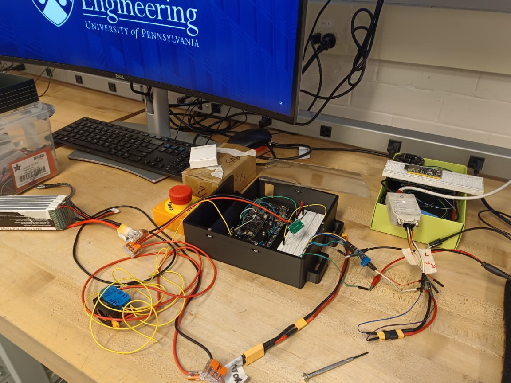

# 💪 Comparative Control Study for Elbow Exoskeleton Under Time-Varying Human Dynamics (On-Going*)

> **Description**: I am exploring a sensor fusion framework integrating kinematic, torque, and EMG data to robustly estimate user state for adaptive control of a single-DOF elbow exoskeleton during repetitive lifting tasks. Time-varying human dynamics such as fatigue, impedance changes, and overlapping kinematics lead to misclassification of user state and suboptimal assistance when relying on single sensing modalities. Through comparative controller evaluation and ablation studies, this project is aimed to quantify how multi-modal sensing (EMG + IMU + MoCap) improves adaptive control performance and enables more reliable, responsive assistance. For this project, I developed a lightweight exoskeleton (450 g arm link + 650 g backpack) powered by a Cubemars AK45-36 KV80 BLDC actuator (15 Nm output torque, 120° ROM).

[](https://github.com)
[](https://github.com)
[](https://github.com)
[](https://github.com)

<div align="center">
<p float="left">
  
  
</p>
</div>

**Full System Pipeline:**
EMG + IMU + MoCap → Sensor Fusion → User State Estimation → Adaptive Controller → BLDC Actuator → Elbow Assistance

</div>

---

## 📋 Table of Contents

- [Overview](#-overview)
- [Key Features](#-key-features)
- [System Architecture](#-system-architecture)
- [Technical Approach](#-technical-approach)
  - [1. Hardware Design](#1-hardware-design)
  - [2. Multi-Modal Sensor Fusion](#2-multi-modal-sensor-fusion)
  - [3. Comparative Controller Evaluation](#3-comparative-controller-evaluation)
- [Performance Results](#-performance-results)
- [References](#-references)
- [Acknowledgments](#-acknowledgments)

---

## 🎯 Overview

Upper limb exoskeletons for repetitive industrial tasks must adapt to time-varying human dynamics: fatigue, impedance changes, and overlapping kinematics. Single-modality sensing leads to state misclassification and suboptimal assistance. This project develops a sensor fusion framework integrating EMG, IMU, and MoCap to robustly estimate user state during repetitive lifting tasks. Through comparative controller evaluation and ablation studies, we quantify how multi-modal sensing improves adaptive control performance and enables more reliable, responsive assistance.

---

**Institution**: University of Pennsylvania  
**Exoskeleton**: 1-DOF elbow, 120° ROM, 1100 g total weight  
**Actuator**: Cubemars AK45-36 KV80 BLDC (15 Nm continuous, 24 Nm peak)  
**Sensing**: EMG + IMU + Motion Capture

---

## ✨ Key Features

### 🔧 Core Capabilities

- ✅ **Single-DOF Elbow Exoskeleton** — 120° range of motion, 450 g arm link
- ✅ **Cubemars AK45-36 BLDC Actuator** — 15 Nm output torque, back-driven for transparency
- ✅ **Back-Mounted Power/Control Unit** — 650 g, wireless operation
- ✅ **Multi-Modal Sensor Fusion** — EMG + IMU + MoCap integrated state estimation
- ✅ **Fatigue Detection** — tracks time-varying muscle activation and joint impedance
- ✅ **Comparative Controller Study** — ablation analysis (EMG-only, IMU-only, fused)
- ✅ **Adaptive Assistance** — torque profiles adjust to detected user state
- ✅ **Repetitive Task Protocol** — lifting cycles to induce fatigue and test robustness

### 🎓 Advanced Techniques

- Kalman filtering for sensor fusion across asynchronous EMG/IMU/MoCap streams
- Fatigue index computation from EMG median frequency shift and RMS amplitude decay
- Impedance estimation from joint torque-angle phase portraits
- Overlapping kinematic disambiguation via multi-modal likelihood weighting

---

## 🏗️ System Architecture

```
┌─────────────────────────────────────────────────────────────────────┐
│              ELBOW EXOSKELETON CONTROL SYSTEM                       │
│                                                                     │
│   ┌──────────────────────────────────────────────────────────────┐  │
│   │                  SENSING LAYER                               │  │
│   │                                                              │  │
│   │   EMG Sensors (biceps, triceps)                              │  │
│   │     ├── Muscle activation intent                             │  │
│   │     └── Fatigue indicators (median freq, RMS)                │  │
│   │                      │                                       │  │
│   │   IMU (elbow joint)                                          │  │
│   │     ├── Joint angle, velocity, acceleration                  │  │
│   │     └── Motion phase detection                               │  │
│   │                      │                                       │  │
│   │   MoCap (ground truth)                                       │  │
│   │     └── High-precision kinematic validation                  │  │
│   └──────────────────────┬───────────────────────────────────────┘  │
│                          │                                          │
│                          ▼                                          │
│   ┌──────────────────────────────────────────────────────────────┐  │
│   │              SENSOR FUSION FRAMEWORK                         │  │
│   │                                                              │  │
│   │   Kalman Filter / Complementary Filter                       │  │
│   │     Input:  EMG(t), IMU(t), MoCap(t)                         │  │
│   │     Output: User state estimate                              │  │
│   │                                                              │  │
│   │   State variables:                                           │  │
│   │     - Joint angle θ, velocity θ̇                              │  │
│   │     - Muscle activation level (normalized EMG)               │  │
│   │     - Fatigue index (0 = fresh, 1 = exhausted)               │  │
│   │     - Estimated joint impedance                              │  │
│   └──────────────────────┬───────────────────────────────────────┘  │
│                          │  fused state estimate                    │
│                          ▼                                          │
│   ┌──────────────────────────────────────────────────────────────┐  │
│   │          COMPARATIVE CONTROLLER EVALUATION                   │  │
│   │                                                              │  │
│   │   Controller A: EMG-only (baseline)                          │  │
│   │   Controller B: IMU-only (baseline)                          │  │
│   │   Controller C: Fused EMG+IMU+MoCap (proposed)               │  │
│   │                                                              │  │
│   │   Metrics: Assistance timing accuracy, torque tracking,      │  │
│   │            false positive rate, fatigue adaptation           │  │
│   └──────────────────────┬───────────────────────────────────────┘  │
│                          │  torque command                          │
│                          ▼                                          │
│   ┌──────────────────────────────────────────────────────────────┐  │
│   │          ADAPTIVE CONTROLLER                                 │  │
│   │                                                              │  │
│   │   Torque profile selection based on:                         │  │
│   │     - Detected motion phase (rest / lift / lower)            │  │
│   │     - Fatigue level (scale assistance magnitude)             │  │
│   │     - Estimated impedance (adjust compliance)                │  │
│   └──────────────────────┬───────────────────────────────────────┘  │
│                          │                                          │
│                          ▼                                          │
│   ┌──────────────────────────────────────────────────────────────┐  │
│   │          CUBEMARS AK45-36 BLDC ACTUATOR                      │  │
│   │                                                              │  │
│   │   Input:   Torque setpoint (Nm)                              │  │
│   │   Output:  Elbow joint torque (15 Nm max continuous)         │  │
│   │   Control: Current loop on motor controller                  │  │
│   └──────────────────────────────────────────────────────────────┘  │
└─────────────────────────────────────────────────────────────────────┘
```


---

## 🔬 Technical Approach

<div align="center">
<p float="left">
  
  
</p>
</div>


### 1. Hardware Design

| Component | Specification |
|-----------|---------------|
| DOF | 1 (elbow flexion/extension, 120° ROM) |
| Actuator | Cubemars AK45-36 KV80 BLDC (15 Nm continuous, 24 Nm motor peak) |
| Arm Link | 450 g |
| Power/Control Backpack | 650 g |
| Total Weight | 1100 g |

**Sensing**: EMG (biceps/triceps, 1000 Hz), IMU (elbow joint, 200 Hz), MoCap (ground truth)

### 2. Multi-Modal Sensor Fusion

**Fatigue Detection**: EMG median frequency shift and RMS amplitude decay over repetitive cycles

**Impedance Estimation**: Joint torque-angle relationship fitted to stiffness + damping model

**Kalman Fusion**: Integrates asynchronous EMG/IMU/MoCap streams into unified state estimate (angle, velocity, muscle activation, fatigue index)

### 3. Comparative Controller Evaluation

* On-going

**Metrics**: Assistance timing accuracy, false positive rate, fatigue adaptation

---

## 📊 Performance Results


### Ablation Study


---

## 📖 References

---

## 🙏 Acknowledgments

- **University of Pennsylvania** — for laboratory facilities and research support
- **Study Participants** — volunteers for repetitive lifting protocols and fatigue testing

---

<div align="center">

### 💪 Multi-Modal Sensing for Adaptive Exoskeleton Control

**EMG + IMU + MoCap → Sensor Fusion → User State → Adaptive Control → Elbow Assistance**

---

### 📊 Results  

---

[⬆ Back to Top](#-comparative-control-study-for-elbow-exoskeleton-under-time-varying-human-dynamics)

</div>

---

## 📄 License

Research project developed at the University of Pennsylvania.