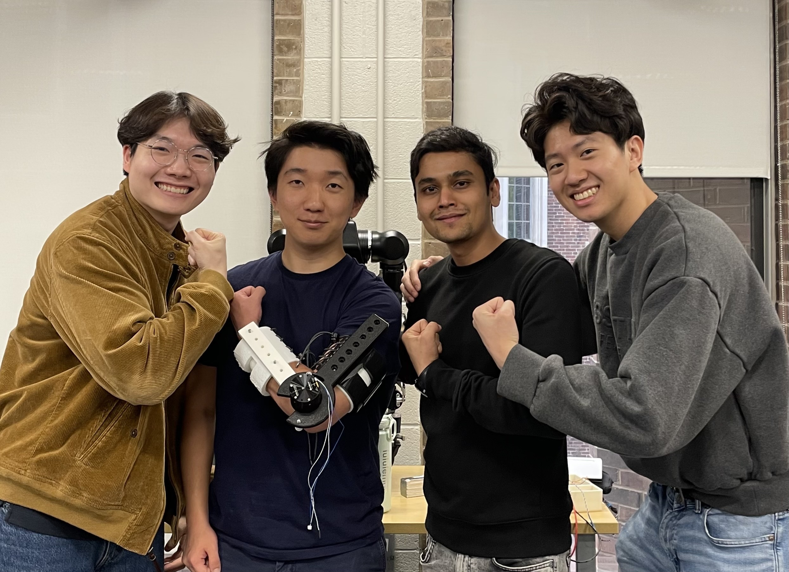
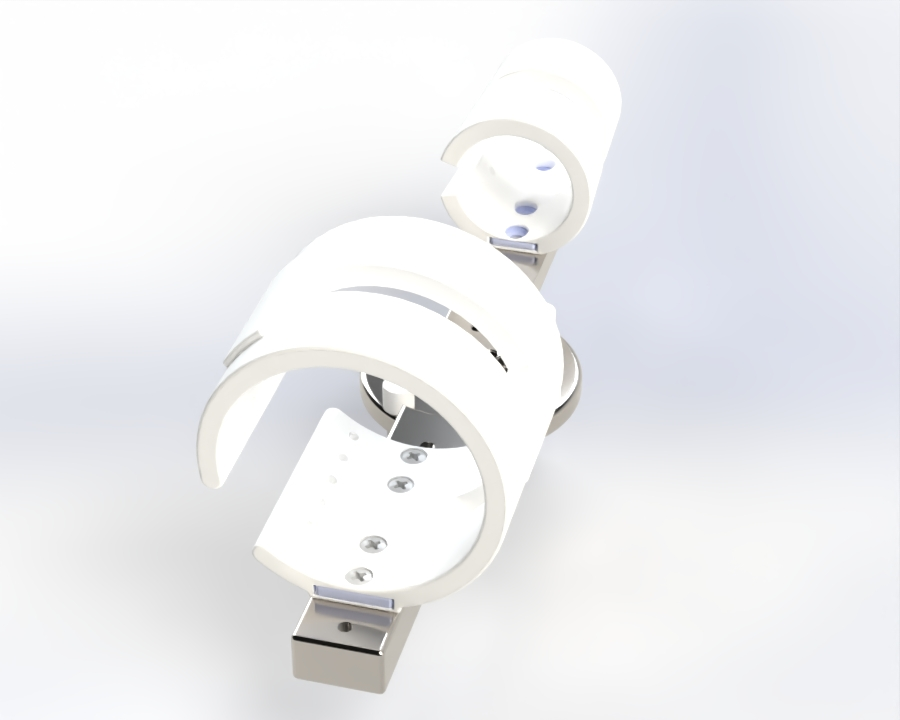
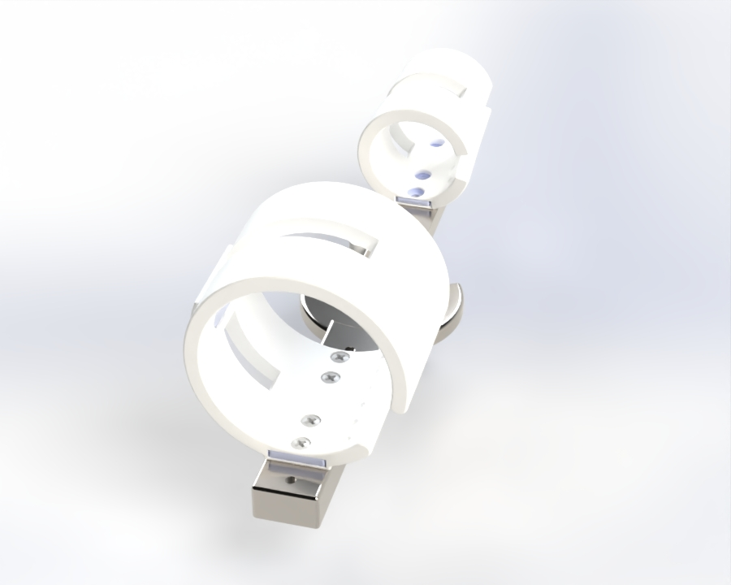
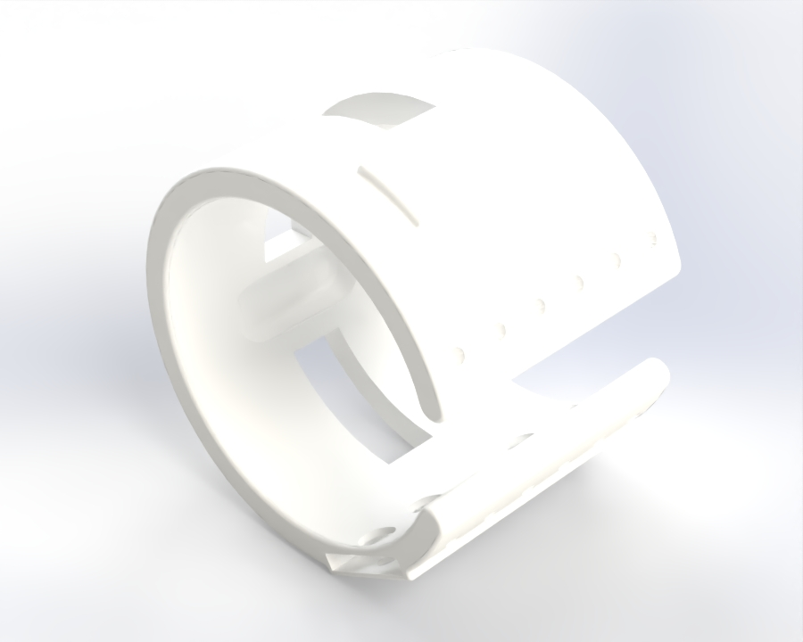
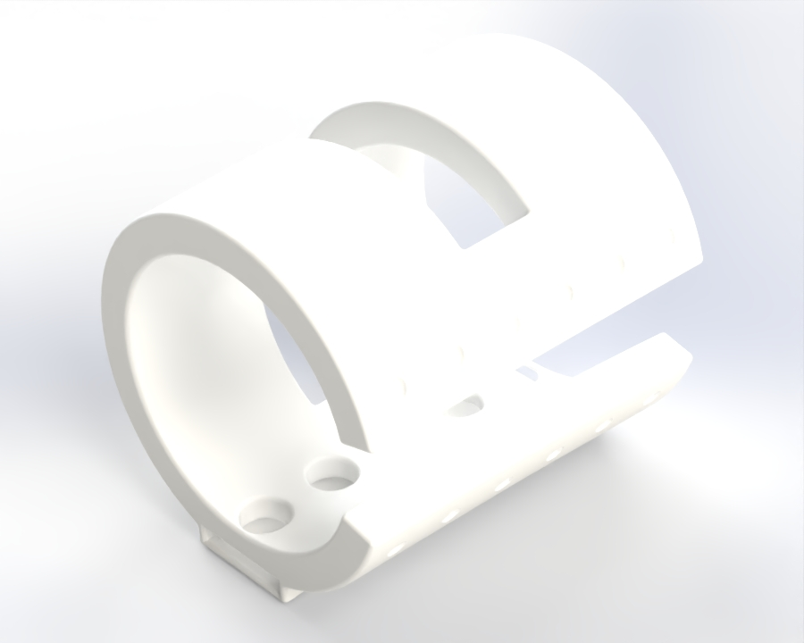
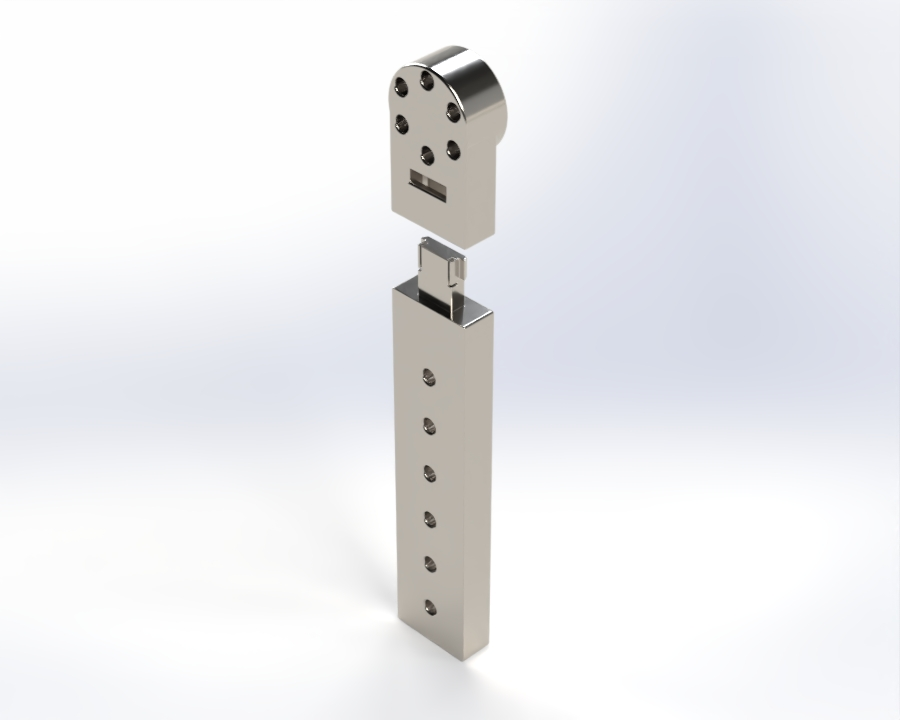
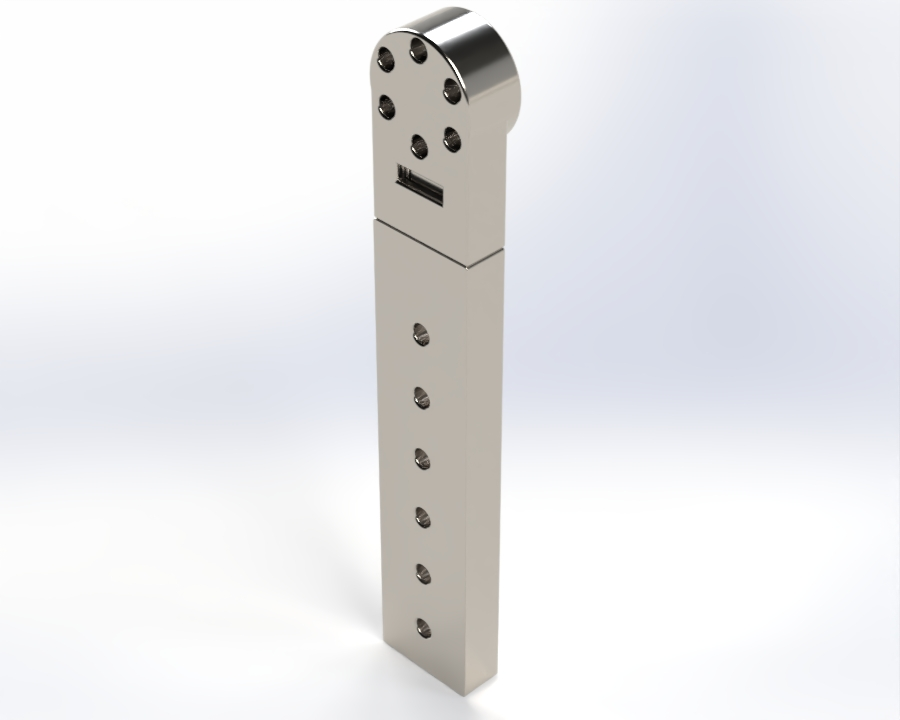
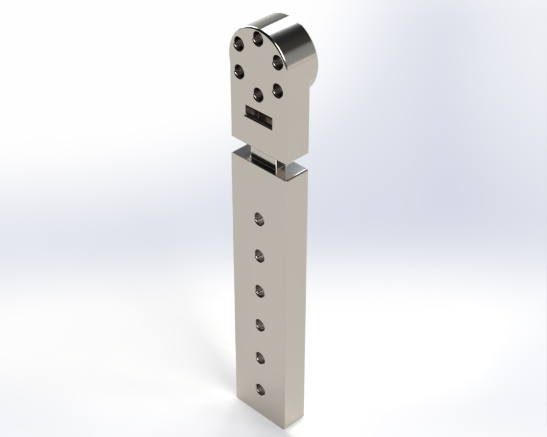

# 💪 Elbow Exoskeleton Project (On-Going*)

[](https://github.com)
[](https://github.com)
[](https://github.com)
[](https://github.com)


<div align="center">
<p float="left">
  
</p>
</div>

---

## 📋 Table of Contents

- [Overview](#-overview)
- [Key Features](#-key-features)
- [Repository Structure](#-repository-structure)
- [System Architecture](#-system-architecture)
- [Technical Approach](#-technical-approach)
  - [1. Hardware Design](#1-hardware-design)
    - [1.1 Left vs. Right Arm Versions](#11-left-vs-right-arm-versions)
    - [1.2 Structural Linkages](#12-structural-linkages)
    - [1.3 Orthotics](#13-orthotics)
    - [1.4 Safety Systems](#14-safety-systems)
    - [1.5 Snap-Fit Forearm Extension](#15-snap-fit-forearm-extension)
    - [1.6 Materials & Print Settings](#16-materials--print-settings)
    - [1.7 Bill of Materials](#17-bill-of-materials)
  - [2. Multi-Modal Sensor Fusion](#2-multi-modal-sensor-fusion)
  - [3. Comparative Controller Evaluation](#3-comparative-controller-evaluation)
- [CAD Files](#-cad-files)
- [STL Files & Printing Guide](#-stl-files--printing-guide)
- [Assembly Instructions](#-assembly-instructions)
- [Donning & Doffing](#-donning--doffing)
- [Performance Results](#-performance-results)
- [Acknowledgments](#-acknowledgments)

---

## 🎯 Overview

Upper limb exoskeletons for repetitive industrial tasks must adapt to time-varying human dynamics: fatigue, impedance changes, and overlapping kinematics. Single-modality sensing leads to state misclassification and suboptimal assistance. This project develops a sensor fusion framework integrating EMG, IMU, and MoCap to robustly estimate user state during repetitive lifting tasks. Through comparative controller evaluation and ablation studies, we quantify how multi-modal sensing improves adaptive control performance and enables more reliable, responsive assistance.

---

**Institution**: University of Pennsylvania  
**Exoskeleton**: 1-DOF elbow, 0–115° ROM, 1100 g total weight  
**Actuator**: Cubemars AK45-36 KV80 BLDC (15 Nm continuous, 24 Nm peak)  
**Sensing**: EMG + IMU + Motion Capture

---

## ✨ Key Features

### 🔧 Core Capabilities

- ✅ **Single-DOF Elbow Exoskeleton** — 0–115° range of motion, matching typical human elbow flexion/extension
- ✅ **Left & Right Arm Versions** — mirrored CAD designs accommodating both limbs
- ✅ **Cubemars AK45-36 BLDC Actuator** — 15 Nm output torque, back-driven for transparency
- ✅ **Snap-Fit Forearm Linkage** — two-piece print-in-place design compensating for ~8 mm elbow COR shift during actuation
- ✅ **Dual Safety Stops** — software joint-angle limit + hardware M6 screw/nut with TPU cover
- ✅ **Multi-Size Orthotics** — 3 forearm sizes (R35/40/45) and 3 upper arm sizes (R45/50/55 mm inner radius)
- ✅ **Structural Orthotic Inserts** — PLA inserts inside TPU orthotics to minimize torsional twist at linkage interfaces
- ✅ **EMG Sensor Slots** — integrated bicep and tricep sensor pockets in upper arm orthotic
- ✅ **Back-Mounted Power/Control Unit** — 650 g, wireless operation
- ✅ **Multi-Modal Sensor Fusion** — EMG + IMU + MoCap integrated state estimation
- ✅ **Fatigue Detection** — tracks time-varying muscle activation and joint impedance
- ✅ **Comparative Controller Study** — ablation analysis (EMG-only, IMU-only, fused)
- ✅ **Adaptive Assistance** — torque profiles adjust to detected user state

### 🎓 Advanced Techniques

- Kalman filtering for sensor fusion across asynchronous EMG/IMU/MoCap streams
- Fatigue index computation from EMG median frequency shift and RMS amplitude decay
- Impedance estimation from joint torque-angle phase portraits
- Overlapping kinematic disambiguation via multi-modal likelihood weighting

---

## 📁 Repository Structure

```
elbow_exoskeleton/
├── Images/                        # Photos and renders used in README
├── CAD/
│   ├── Elbow Exoskeleton - Left/  # SolidWorks files for the left arm assembly
│   │   ├── Elbow Exoskeleton - Left.sldasm
│   │   ├── Forearm linkage assembly.sldasm
│   │   ├── Forearm linkage base.sldprt
│   │   ├── Forearm linkage front.sldprt
│   │   ├── Forearm orthotic R45 - Left.sldprt
│   │   ├── Forearm orthotic structural insert.sldprt
│   │   ├── Mechanical stop cover.sldprt
│   │   ├── Upper arm linkage - Left.sldprt
│   │   ├── Upper arm orthotic R55 - Left.sldprt
│   │   ├── Upper arm orthotic structural insert.sldprt
│   │   ├── AK45-36-KV80 motor.sldprt
│   │   ├── ANR Muscle Sense Model M40 EMG sensor.sldprt
│   │   ├── 90592A016_Steel Hex Nut_M6.sldprt
│   │   ├── 92005A427_Steel Pan Head Phillips Screw_M6_18mm.sldprt
│   │   └── 92005A435_Steel Pan Head Phillips Screw_M6_30mm.sldprt
│   ├── Elbow Exoskeleton - Right/ # SolidWorks files for the right arm assembly
│   │   ├── Elbow Exoskeleton - Right.sldasm
│   │   ├── Forearm linkage assembly.sldasm
│   │   ├── Forearm linkage base.sldprt
│   │   ├── Forearm linkage front.sldprt
│   │   ├── Forearm orthotic R45 - Right.sldprt
│   │   ├── Forearm orthotic structural insert.sldprt
│   │   ├── Mechanical stop cover.sldprt
│   │   ├── Upper arm linkage - Right.sldprt
│   │   ├── Upper arm orthotic R55 - Right.sldprt
│   │   ├── Upper arm orthotic structural insert.sldprt
│   │   ├── AK45-36-KV80 motor.sldprt
│   │   ├── ANR Muscle Sense Model M40 EMG sensor.sldprt
│   │   ├── 90592A016_Steel Hex Nut_M6.sldprt
│   │   ├── 92005A427_Steel Pan Head Phillips Screw_M6_18mm.sldprt
│   │   └── 92005A435_Steel Pan Head Phillips Screw_M6_30mm.sldprt
│   └── STL files/                 # Print-ready STL files for all printed parts
│       ├── Forearm linkage assembly.stl
│       ├── Forearm orthotic R35/R40/R45 - Left/Right.stl  (6 files)
│       ├── Upper arm orthotic R45/R50/R55 - Left/Right.stl (6 files)
│       ├── Forearm orthotic structural insert.stl
│       ├── Upper arm orthotic structural insert.stl
│       ├── Upper arm linkage - Left/Right.stl
│       └── Mechanical stop cover.stl
├── Print Files/
│   ├── BambuStudio/               # .3mf Bambu Studio project files with pre-configured print settings
│   └── Print Orientation Guide/   # Screenshots showing recommended print orientations
└── README.md
```

> **Note on Left vs. Right folders:** Each assembly folder contains all parts needed to open and rebuild that assembly in SolidWorks — shared parts (forearm linkage, structural inserts, hardware) are duplicated across both folders for self-containment. The only parts that differ between folders are the upper arm linkage, upper arm orthotic, and forearm orthotic, which are mirrored versions of each other. Only **one orthotic size is included per assembly folder** (the example shown uses R45 forearm / R55 upper arm) — select the appropriate size for your subject from the full set in `CAD/STL files/`.

---

## 🏗️ System Architecture

```
┌─────────────────────────────────────────────────────────────────────┐
│              ELBOW EXOSKELETON CONTROL SYSTEM                       │
│                                                                     │
│   ┌──────────────────────────────────────────────────────────────┐  │
│   │                  SENSING LAYER                               │  │
│   │                                                              │  │
│   │   EMG Sensors (biceps, triceps)                              │  │
│   │     ├── Muscle activation intent                             │  │
│   │     └── Fatigue indicators (median freq, RMS)                │  │
│   │                      │                                       │  │
│   │   IMU (elbow joint)                                          │  │
│   │     ├── Joint angle, velocity, acceleration                  │  │
│   │     └── Motion phase detection                               │  │
│   │                      │                                       │  │
│   │   MoCap (ground truth)                                       │  │
│   │     └── High-precision kinematic validation                  │  │
│   └──────────────────────┬───────────────────────────────────────┘  │
│                          │                                          │
│                          ▼                                          │
│   ┌──────────────────────────────────────────────────────────────┐  │
│   │              SENSOR FUSION FRAMEWORK                         │  │
│   │                                                              │  │
│   │   Kalman Filter / Complementary Filter                       │  │
│   │     Input:  EMG(t), IMU(t), MoCap(t)                         │  │
│   │     Output: User state estimate                              │  │
│   │                                                              │  │
│   │   State variables:                                           │  │
│   │     - Joint angle θ, velocity θ̇                              │  │
│   │     - Muscle activation level (normalized EMG)               │  │
│   │     - Fatigue index (0 = fresh, 1 = exhausted)               │  │
│   │     - Estimated joint impedance                              │  │
│   └──────────────────────┬───────────────────────────────────────┘  │
│                          │  fused state estimate                    │
│                          ▼                                          │
│   ┌──────────────────────────────────────────────────────────────┐  │
│   │          COMPARATIVE CONTROLLER EVALUATION                   │  │
│   │                                                              │  │
│   │   Controller A: EMG-only (baseline)                          │  │
│   │   Controller B: IMU-only (baseline)                          │  │
│   │   Controller C: Fused EMG+IMU+MoCap (proposed)               │  │
│   │                                                              │  │
│   │   Metrics: Assistance timing accuracy, torque tracking,      │  │
│   │            false positive rate, fatigue adaptation           │  │
│   └──────────────────────┬───────────────────────────────────────┘  │
│                          │  torque command                          │
│                          ▼                                          │
│   ┌──────────────────────────────────────────────────────────────┐  │
│   │          ADAPTIVE CONTROLLER                                 │  │
│   │                                                              │  │
│   │   Torque profile selection based on:                         │  │
│   │     - Detected motion phase (rest / lift / lower)            │  │
│   │     - Fatigue level (scale assistance magnitude)             │  │
│   │     - Estimated impedance (adjust compliance)                │  │
│   └──────────────────────┬───────────────────────────────────────┘  │
│                          │                                          │
│                          ▼                                          │
│   ┌──────────────────────────────────────────────────────────────┐  │
│   │          CUBEMARS AK45-36 BLDC ACTUATOR                      │  │
│   │                                                              │  │
│   │   Input:   Torque setpoint (Nm)                              │  │
│   │   Output:  Elbow joint torque (15 Nm max continuous)         │  │
│   │   Control: Current loop on motor controller                  │  │
│   └──────────────────────────────────────────────────────────────┘  │
└─────────────────────────────────────────────────────────────────────┘
```

---

## 🔬 Technical Approach

<div align="center">
<p float="left">
  
  
</p>
</div>

### 1. Hardware Design

#### 1.1 Left vs. Right Arm Versions

The exoskeleton is available in two mirrored versions — **Left** and **Right** — to accommodate both arms. The motor is positioned at the elbow joint and the user operates with **palms facing upward** (supinated). Shoe laces run along the **top** of each orthotic, and the orthotics mount to their respective linkages from the side.

The **forearm linkage assembly is identical** across both versions. Only the following parts differ (mirrored CAD):

| Part | Left Version | Right Version |
|------|-------------|--------------|
| Upper arm linkage | ✅ | ✅ |
| Upper arm orthotic | ✅ | ✅ |
| Forearm orthotic | ✅ | ✅ |
| Forearm linkage | Shared | Shared |

<div align="center">
<p float="left">
  
  
</p>
<em>Left (left) and Right (right) arm versions of the elbow exoskeleton assembly</em>
</div>

#### 1.2 Structural Linkages

<div align="center">
<p float="left">
  
  
</p>
</div>

Both linkages bolt directly onto the **Cubemars AK45-36 motor** using M3 screws.

| Component | Dimensions (L × W × H) | Notes |
|-----------|------------------------|-------|
| Forearm linkage | ~210 × 35 × 19 mm | Two-piece snap-fit assembly |
| Upper arm linkage | ~270 × 110 × 24 mm | Left/right mirrored versions |

Each linkage features **6–7 orthotic mounting holes spaced 21 mm apart**, allowing adjustment for different user arm lengths and optimal orthotic placement. The 21 mm hole spacing provides approximately 126 mm of total adjustment range, accommodating a broad range of adult arm proportions.

The wall thicknesses and cross-sections were sized to safely transmit the actuator's 15 Nm continuous output torque, providing adequate safety margin for the expected bending and torsional loads on the linkages.

#### 1.3 Orthotics

Both orthotics are printed in **TPU** for compliance and comfort against the user's skin. Key design features:

- **6 shoe lace holes per side** of the opening for secure tightening onto the user's arm
- **6 mm EVA foam** bonded to the inner surface with Barge cement for pressure distribution and comfort
- **Structural inserts** (printed in PLA, 75% infill) embedded at the orthotic-to-linkage interface to resist torsional twist during actuation
- **3 size options per orthotic** to accommodate different arm circumferences

| Orthotic | Inner Radius Options | Shape | Thickness |
|----------|----------------------|-------|-----------|
| Forearm orthotic | R35 / R40 / R45 mm | Slightly tapered (follows human forearm geometry) | 10 mm |
| Upper arm orthotic | R45 / R50 / R55 mm | Cylindrical | 10 mm |

The 10 mm wall thickness balances structural rigidity with mass, limiting deformation under circumferential loads while remaining flexible enough for comfortable donning/doffing. The R35–R45 forearm range and R45–R55 upper arm range cover a broad range of adult arm circumferences.

The **upper arm orthotic** additionally includes **2 recessed EMG sensor slots** — one positioned over the biceps and one over the triceps — to securely house the ANR Muscle Sense M40 sensors during data collection.

<div align="center">
<p float="left">
  
  
</p>
<em>Upper arm orthotic (left) showing EMG sensor slots and shoe lace holes; Forearm orthotic (right) showing tapered geometry and lace holes</em>
</div>

#### 1.4 Safety Systems

The exoskeleton incorporates **two independent layers of safety** to protect the user from joint over-travel:

1. **Software stop**: Joint angle limits enforced in the motor controller firmware (0° and 115°).
2. **Hardware mechanical stop**: Two **M6 screw + M6 hex nut** assemblies physically block the forearm linkage at each end of the range of motion, with a **TPU mechanical stop cover** over each screw head to cushion contact and prevent metal-on-metal impact.

The two hardware stops differ intentionally in their mounting geometry on the upper arm linkage:

- **0° stop (full extension)**: Mounted in a **fixed hole**, providing a firm absolute limit at full extension.
- **115° stop (full flexion)**: Mounted in a **slot** rather than a fixed hole, allowing the screw position to be adjusted by up to ~25°. This accommodates users whose natural maximum elbow flexion differs from the default 115° setting — the effective hardware limit can be set anywhere in the **115°–140°** range to match the individual user's anatomy.

This dual-layer approach ensures that even in the event of a software fault, the user is protected from harmful range-of-motion exceedance.

#### 1.5 Snap-Fit Forearm Extension

During elbow flexion/extension, the **center of rotation (COR) of the human elbow joint shifts by approximately 8 mm** due to the cam-like geometry of the distal humerus. A rigid forearm linkage would fight this shift, creating uncomfortable shear forces on the user's arm.

To compensate, the forearm linkage is split into two pieces — a **base** and a **front** — joined by a **print-in-place snap-fit**. This allows the linkage to extend longitudinally, passively accommodating the COR shift throughout the range of motion without requiring any user adjustment.

<div align="center">
<p float="left">
  
</p>
<em>The two pieces of the forearm linkage — base (bottom) and front (top) — before assembly</em>
</div>

<div align="center">
<p float="left">
  
  
</p>
<em>Snap-fit forearm linkage in retracted position (left) and extended position (right), passively accommodating the ~8 mm elbow COR shift during actuation</em>
</div>

#### 1.6 Materials & Print Settings

All parts use **4 perimeter wall loops**, which is the primary driver of strength in FDM prints — particularly for thin-walled curved geometries like orthotics where the walls *are* the structure.

| Part | Material | Infill | Wall Loops | Rationale |
|------|----------|--------|------------|-----------|
| Forearm linkage (base + front) | PLA | 75% | 4 | Structural; transmits motor torque |
| Upper arm linkage (L/R) | PLA | 75% | 4 | Structural; transmits motor torque |
| Forearm orthotic structural insert | PLA | 75% | 4 | Stiffens orthotic-linkage interface |
| Upper arm orthotic structural insert | PLA | 75% | 4 | Stiffens orthotic-linkage interface |
| Forearm orthotics (all sizes, L/R) | TPU | 15% | 4 | Flexible and compliant; walls provide shape, low infill keeps part soft and lightweight |
| Upper arm orthotics (all sizes, L/R) | TPU | 15% | 4 | Flexible and compliant; walls provide shape, low infill keeps part soft and lightweight |
| Mechanical stop cover | TPU | 15% | 4 | Soft impact absorption; low infill maximises cushioning effect |

**PLA parts (75% infill):** 75% infill provides near-maximum mechanical performance for structural components. Diminishing returns in tensile strength occur beyond ~70–80% infill, making 75% a practical ceiling for load-bearing parts.

**TPU parts (15% infill):** For flexible TPU orthotics and the mechanical stop cover, low infill (15%) is intentional — it preserves the material's compliance and keeps mass low, while the 4 wall loops provide sufficient shape retention and contact stiffness at the skin interface. Higher infill in TPU would make the part unnecessarily stiff and heavy without meaningful structural benefit.

**Print orientation notes**: See `Print Files/Print Orientation Guide/` for Bambu Studio screenshots. Key considerations:
- **Orthotics**: Print standing upright with the opening face-down to maximize layer adhesion around the circumference and shoe lace holes.
- **Forearm linkage assembly**: Print flat with the snap-fit joint oriented horizontally to ensure proper engagement of the snap features.
- **Linkages**: Print flat on their largest face to maximize bending strength along the primary load direction.

#### 1.7 Bill of Materials

| Item | Quantity | Notes |
|------|----------|-------|
| Cubemars AK45-36 KV80 BLDC motor | 1 | Actuator, 15 Nm continuous |
| ANR Muscle Sense M40 EMG sensor | 2 | Bicep + tricep |
| M3 screws (motor mount) | ~8 | Linkage-to-motor attachment |
| M6 × 18 mm Pan Head Phillips screw | 2 | Hardware stop (0° and 115°) |
| M6 × 30 mm Pan Head Phillips screw | As needed | Hardware stop alternate length |
| M6 hex nut | 2 | Hardware stop |
| PLA filament | ~500 g | Linkages and structural inserts |
| TPU filament | ~300 g | Orthotics and mechanical stop cover |
| 6 mm EVA foam sheet | ~400 cm² | Inner orthotic padding |
| Barge contact cement | Small amount | Bonding EVA foam to orthotics |
| Shoe laces | 2 pairs | Securing orthotics to user |

---

## 🔩 Assembly Instructions

### Part 1 — Print & Hardware Prep

1. Print all 3D printed parts using the provided `.3mf` files (see [STL Files & Printing Guide](#-stl-files--printing-guide)). Remove all supports after printing — note that TPU support removal is particularly time-consuming.
2. Gather all hardware: M3 screws, M6 screws, M6 hex nuts, and mechanical stop covers.

### Part 2 — EVA Foam Padding

3. Cut the 6 mm EVA foam sheets to the approximate shape of the inner surface of each orthotic.
4. Apply Barge contact cement to both the EVA foam and the inner surface of the orthotic. Allow to become tacky per the cement's instructions, then press the foam firmly onto the orthotic interior.
5. Trim any excess foam with scissors so it sits flush with the orthotic edges.
6. Place a cylindrical object (e.g. a water bottle or PVC pipe of similar diameter) inside each orthotic to apply constant outward pressure on the foam against the orthotic wall while the cement fully cures. Leave until fully adhered.

### Part 3 — Orthotic Assembly

7. Thread shoe laces through the 6 lace holes on each side of both orthotics.
8. Screw each orthotic to its respective linkage using the orthotic mounting holes. Select the mounting hole position that best matches the user's arm length for optimal coverage and comfort.
9. Press the PLA structural inserts into the orthotic-to-linkage interface locations to reinforce those areas against torsional twist during actuation.

### Part 4 — Linkage-to-Motor Assembly

10. Attach the forearm linkage assembly to the Cubemars AK45-36 motor output shaft using M3 screws.
11. Attach the upper arm linkage to the motor body using M3 screws.
12. Install the two M6 hardware stops: the fixed-hole stop for the 0° (full extension) limit and the slot-mounted stop for the 115°–140° (full flexion) limit. Fit the TPU mechanical stop covers over each screw head.

---

## 🦾 Donning & Doffing

The exoskeleton is worn and removed as a **single fully-assembled unit** — the linkages, orthotics, and motor are not disassembled between uses. Donning and doffing simply involves sliding the assembled system onto or off the arm.

### Putting On

1. Loosen the shoe laces on both orthotics fully.
2. With the arm **straight out** (fully extended, 0°), slide the assembled exoskeleton onto the arm — the **upper arm orthotic end goes on first**, positioning it along the upper arm.
3. Continue sliding the assembly along the arm until the **forearm orthotic sits along the forearm** and, critically, the **motor sits at the elbow joint center of rotation**. This alignment is essential for comfort and effective torque transmission.
4. Tighten the shoe laces on both orthotics until they are secure but not uncomfortable for the user.
5. Connect the electronics and power source. The exoskeleton is ready to operate.

### Taking Off

1. Power down and disconnect the electronics and power source.
2. Loosen the shoe laces on both orthotics.
3. Slide the entire assembled exoskeleton off the arm, **forearm end first**.

---

## 📐 CAD Files

The SolidWorks files are organised into two self-contained assembly folders under `CAD/` — one per arm side — each containing all parts needed to open and fully resolve the assembly.

**[`CAD/Elbow Exoskeleton - Left/`](CAD/Elbow%20Exoskeleton%20-%20Left/)**
- `Elbow Exoskeleton - Left.sldasm`
- `Forearm linkage assembly.sldasm`, `Forearm linkage base.sldprt`, `Forearm linkage front.sldprt`
- `Upper arm linkage - Left.sldprt`
- `Forearm orthotic R45 - Left.sldprt`, `Forearm orthotic structural insert.sldprt`
- `Upper arm orthotic R55 - Left.sldprt`, `Upper arm orthotic structural insert.sldprt`
- `Mechanical stop cover.sldprt`
- `AK45-36-KV80 motor.sldprt`, `ANR Muscle Sense Model M40 EMG sensor.sldprt`
- `90592A016_Steel Hex Nut_M6.sldprt`, `92005A427_Steel Pan Head Phillips Screw_M6_18mm.sldprt`, `92005A435_Steel Pan Head Phillips Screw_M6_30mm.sldprt`

**[`CAD/Elbow Exoskeleton - Right/`](CAD/Elbow%20Exoskeleton%20-%20Right/)** *(identical structure, right-side mirrored parts)*
- `Elbow Exoskeleton - Right.sldasm`
- Same shared parts as above
- `Upper arm linkage - Right.sldprt`
- `Forearm orthotic R45 - Right.sldprt`
- `Upper arm orthotic R55 - Right.sldprt`

> Each assembly folder includes only one orthotic size for the assembly reference model. All sizes (R35/R40/R45 forearm; R45/R50/R55 upper arm) are available as STL files in [`CAD/STL files/`](CAD/STL%20files/) for printing.

---

## 🖨️ STL Files & Printing Guide

All print-ready STL files are in [`CAD/STL files/`](CAD/STL%20files/). Print settings for each part are listed below. For recommended print orientations and bed setups for each part, see the **[Print Guide](Print%20Files/Print%20Orientation%20Guide/PRINT_ORIENTATION_GUIDE.md)**. The Bambu Studio `.3mf` files below are configured for the **Bambu Lab P1S**.

| File | Material | Infill | Wall Loops |
|------|----------|--------|------------|
| [Forearm linkage assembly](CAD/STL%20files/Forearm%20linkage%20assembly.STL) | PLA | 75% | 4 |
| [Upper arm linkage - Left](CAD/STL%20files/Upper%20arm%20linkage%20-%20Left.STL) | PLA | 75% | 4 |
| [Upper arm linkage - Right](CAD/STL%20files/Upper%20arm%20linkage%20-%20Right.STL) | PLA | 75% | 4 |
| [Forearm orthotic R35 - Left](CAD/STL%20files/Forearm%20orthotic%20R35%20-%20Left.STL) | TPU | 15% | 4 |
| [Forearm orthotic R35 - Right](CAD/STL%20files/Forearm%20orthotic%20R35%20-%20Right.STL) | TPU | 15% | 4 |
| [Forearm orthotic R40 - Left](CAD/STL%20files/Forearm%20orthotic%20R40%20-%20Left.STL) | TPU | 15% | 4 |
| [Forearm orthotic R40 - Right](CAD/STL%20files/Forearm%20orthotic%20R40%20-%20Right.STL) | TPU | 15% | 4 |
| [Forearm orthotic R45 - Left](CAD/STL%20files/Forearm%20orthotic%20R45%20-%20Left.STL) | TPU | 15% | 4 |
| [Forearm orthotic R45 - Right](CAD/STL%20files/Forearm%20orthotic%20R45%20-%20Right.STL) | TPU | 15% | 4 |
| [Upper arm orthotic R45 - Left](CAD/STL%20files/Upper%20arm%20orthotic%20R45%20-%20Left.STL) | TPU | 15% | 4 |
| [Upper arm orthotic R45 - Right](CAD/STL%20files/Upper%20arm%20orthotic%20R45%20-%20Right.STL) | TPU | 15% | 4 |
| [Upper arm orthotic R50 - Left](CAD/STL%20files/Upper%20arm%20orthotic%20R50%20-%20Left.STL) | TPU | 15% | 4 |
| [Upper arm orthotic R50 - Right](CAD/STL%20files/Upper%20arm%20orthotic%20R50%20-%20Right.STL) | TPU | 15% | 4 |
| [Upper arm orthotic R55 - Left](CAD/STL%20files/Upper%20arm%20orthotic%20R55%20-%20Left.STL) | TPU | 15% | 4 |
| [Upper arm orthotic R55 - Right](CAD/STL%20files/Upper%20arm%20orthotic%20R55%20-%20Right.STL) | TPU | 15% | 4 |
| [Forearm orthotic structural insert](CAD/STL%20files/Forearm%20orthotic%20structural%20insert.STL) | PLA | 75% | 4 |
| [Upper arm orthotic structural insert](CAD/STL%20files/Upper%20arm%20orthotic%20structural%20insert.STL) | PLA | 75% | 4 |
| [Mechanical stop cover](CAD/STL%20files/Mechancial%20stop%20cover.STL) | TPU | 15% | 4 |

**Bambu Studio `.3mf` files** (pre-configured for Bambu Lab P1S, located in `Print Files/BambuStudio/`):

| .3mf File | Contents | Material |
|-----------|----------|----------|
| `Elbow_Exoskeleton_Left_Linkage_&_Inserts_Prints.3mf` | Forearm linkage assembly + Upper arm linkage Left + both structural inserts | PLA |
| `Elbow_Exoskeleton_Left_Orthotics_&_Mechanical_Stop.3mf` | Forearm orthotic R35 Left + Upper arm orthotic R45 Left + Mechanical stop cover ×2 | TPU |
| `Elbow_Exoskeleton_Right_Linkage_&_Inserts_Prints.3mf` | Forearm linkage assembly + Upper arm linkage Right + both structural inserts | PLA |
| `Elbow_Exoskeleton_Right_Orthotics_&_Mechanical_Stop.3mf` | Forearm orthotic R35 Right + Upper arm orthotic R45 Right + Mechanical stop cover ×2 | TPU |

---

## 📊 Performance Results

### Ablation Study

*On-going*

---

## 📄 Acknowledgments

Research project developed at the **University of Pennsylvania GRASP Lab** under the supervision of **Dr. Nadia Figueroa**.

---

<div align="center">

### 💪 Multi-Modal Sensing for Adaptive Exoskeleton Control

**EMG + IMU + MoCap → Sensor Fusion → User State → Adaptive Control → Elbow Assistance**

---

[⬆ Back to Top](#-elbow-exoskeleton-project-on-going)

</div>
